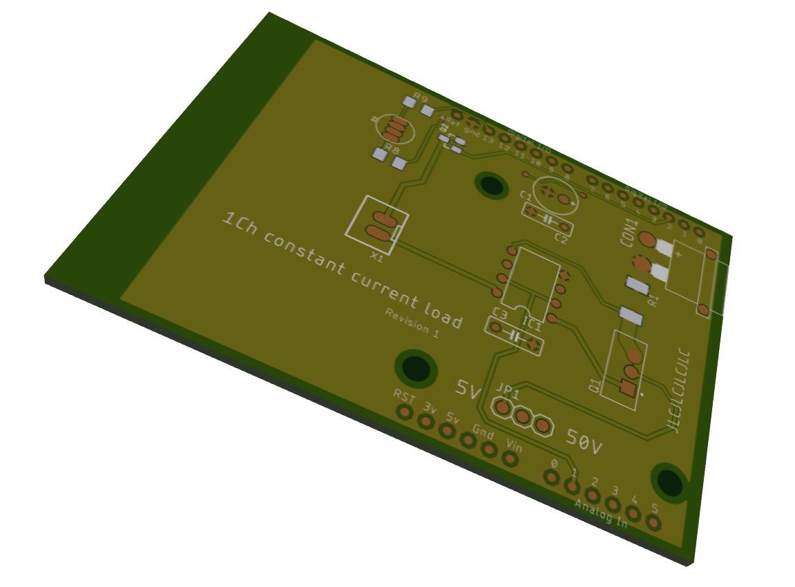

# Software current control board design

This directory contains the Eagle PCB design files for the Arduino shield with all required hardware installed

## Features

* Arduino shield format
* Software adjustable load
* Wide voltage range (0V - 50V)
* Active cooling

## Support

This PCB isn't yet supported as i wait for it to ship from China, this page will be updated when i get the software and hardware ready to use.

BOM and additional information will be available soon.

## Usage

**If your battery voltage exceeds 5V set the voltage switch to the "50V" position to enable the voltage divider.**

Connect your battery to the XT30 connector on the board, all further setup is done through software.

## Considerations

* This board heavily depends on reliable 5V power supply for the Arduino, with unstable voltage your results may drift considerably
* Watch out for the mosfet temperature, while this board has a fan connector you can easily overload it by discharging high currents from high voltage batteries